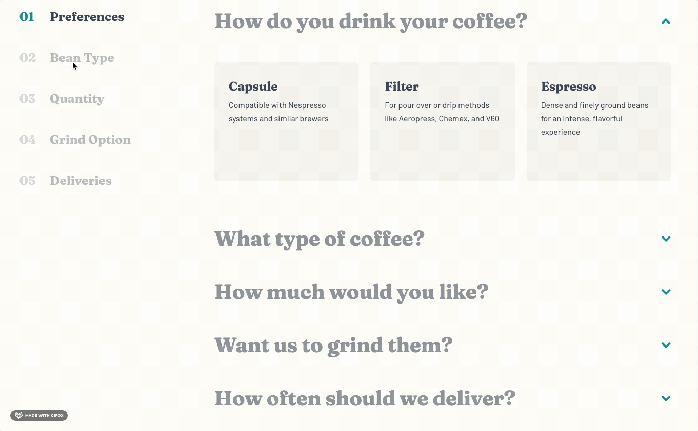

# Frontend Mentor - Coffeeroasters subscription site solution

This is a solution to the [Coffeeroasters subscription site challenge on Frontend Mentor](https://www.frontendmentor.io/challenges/coffeeroasters-subscription-site-5Fc26HVY6). Frontend Mentor challenges help you improve your coding skills by building realistic projects.

## Table of contents

-   [Overview](#overview)
    -   [The challenge](#the-challenge)
    -   [Screenshots](#screenshots)
    -   [Links](#links)
-   [My process](#my-process)
    -   [Built with](#built-with)
    -   [What I learned](#what-i-learned)
    -   [Continued development](#continued-development)
    -   [Useful resources](#useful-resources)
-   [Author](#author)

## Overview

### The challenge

Users should be able to:

-   View the optimal layout for each page depending on their device's screen size
-   See hover states for all interactive elements throughout the site
-   Make selections to create a coffee subscription and see an order summary modal of their choices:
    -   If "Capsule" is selected for the first option
        -   The "Want us to grind them?" section should be disabled and not able to be opened
    -   Order summary texts updates
        -   If "Capsule" is selected, update the order summary text to:
            -   "I drink my coffee **using** Capsules"
            -   Remove the grind selection text
        -   If "Filter" or "Espresso" are selected, update the order summary text to:
            -   "I drink my coffee **as** Filter or Espresso"
            -   Keep/Add the grind selection text
        -   For all other selections, add the selection title in the blank space where appropriate
    -   Updating per shipment price (shown in "How often should we deliver?" section at the bottom) based on weight selected
    -   Calculating per month cost for the Order Summary modal
        -   If Every Week is selected, the Order Summary modal should show the per shipment price multiplied by 4.
        -   If Every 2 Weeks is selected, the Order Summary modal should show the per shipment price multiplied by 2.
        -   If Every Month is selected, the Order Summary modal should show the per shipment price multiplied by 1.

### Screenshots

### Links

-   Solution URL: [Add solution URL here](https://your-solution-url.com)
-   Live Site URL: [Add live site URL here](https://your-live-site-url.com)

## My process

### Built with

-   Semantic HTML5 markup
-   CSS Grid and Flexbox
-   Mobile-first workflow
-   Figma
-   [React](https://reactjs.org/) - JS library
-   [Styled Components](https://styled-components.com/) - For styles
-   [Reach UI](https://reach.tech/) - Accessible React component library. Used the Accordion and Dialog (Modal) components
-   [React Router](https://reactrouter.com/web/guides/quick-start) - For routing between pages
-   [React Scroll](https://github.com/fisshy/react-scroll) - For smooth vertical scrolling

### What I learned

1. One of my focuses for this project was to improve accessibility practices. I was able to implement:

    - A [skip link](./src/components/SkipLink.js)
    - Visually hidden text for screen-readers only
    - ARIA labels
    - Styled focus outlines
    - Meaningful `alt` text
    - Subtle scroll animations
        - When a user clicks a link/button to another page partway down the page, there is a smooth scroll to the top of the new page using [React Router](https://reactrouter.com/web/guides/scroll-restoration)'s [ScrollToTop component](./src/components/ScrollToTop.js)
        - When a user clicks a nav link from the Sidebar component on the plan page on desktop, there is a smooth scroll to the corresponding accordion item in the order form and it opens up that accordion item if it is not already open. This is implemented with [React Scroll](https://github.com/fisshy/react-scroll).
    - Use of `srcset` and `source` for `<picture>` tags

2. File Structure

    - A folder for all the pages of the site with a separate file for each page.
    - Small components.
    - A [GlobalStyles component](./src/components/GlobalStyles.js) with reset and global styles.
    - Component-specific styles at the bottom of component files with [Styled Components](https://styled-components.com/).
    - A [constants.js](./src/constants.js) file to store stylistic variables that are used throughout the project, like colors, fonts, and breakpoints.

3. Implemented a responsive Spacer component that adds different amounts of whitespace between components at different breakpoints instead of relying on margins.

4. Styled the fill color of SVGs so that the logo in the header and footer are different colors and the fill color for the social media icons changes on hover.

5. Used React's useState and useEffect hooks to allow the Sidebar, PlanAccordion, OrderSummary, Button, and Modal in the OrderForm component to speak to each other.

6. I learned how to make the Sidebar (navigation in the OrderForm) sticky. This doesn't require much code but there are many reasons why `position: sticky` may not work which is what happened when I first tried to implement it. It turned out it wasn't originally working for two reasons: it had an ancestor element with `overflow: hidden` and the Sidebar didn't have any height specified, so it was taking up the full height of its parent and didn't have any room to move within its parent.

### Continued development

-   Making sure a website/app is as accessible as possible means being aware of many things. While I tried hard to keep accessibility in mind throughout the whole development process, this is an area I could always learn more about and improve on. One known issue with my Coffeeroasters solution is that when the user clicks on links in the Sidebar to navigate to the corresponding accordion items, the focus stays on the link the user just selected instead of jumping to the accordion item scrolled to. This is an issue for users navigating the website with a keyboard. The same issue exists when a user selects a nav link from the footer to navigate to a different page. Although they are brought to the top of new page, the footer nav link stays focused.

-   Something I'd like to implement in future projects is state management with Redux or Context.

### Useful resources

-   [How to Create a "Skip to Content" Link](https://css-tricks.com/how-to-create-a-skip-to-content-link/) - Explains what skip links are and how to quickly and easily create one.
-   [Let's Bring Spacer GIFs Back!](https://www.joshwcomeau.com/react/modern-spacer-gif/) - Amazing blog post on the rationale for using Spacer components between components to provide whitespace. I just tweaked Josh W Comeau's Spacer component in my project to make it responsive.
-   [VisuallyHidden](https://www.joshwcomeau.com/snippets/react-components/visually-hidden/) - Another blog post by Josh W Comeau. Provides code for a VisuallyHidden component used to wrap around text that is not visible on the page but is read to users who are using a screen-reader.
-   [The HTML picture element explained](https://www.youtube.com/watch?v=Rik3gHT24AM&t=751s&ab_channel=KevinPowell) - Nice video showing how to use the picture element to change the picture that's loaded into the browser based on the screen size.

## Author

-   Frontend Mentor - [@En-Jen](https://www.frontendmentor.io/profile/En-Jen)
